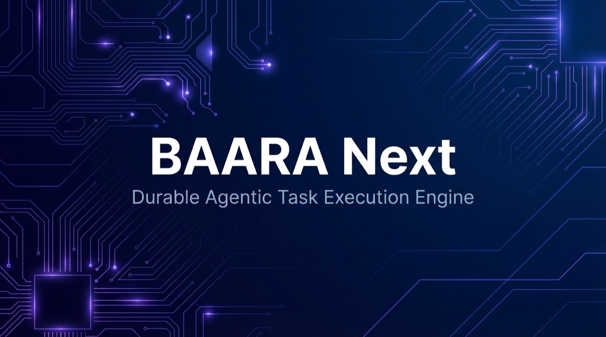
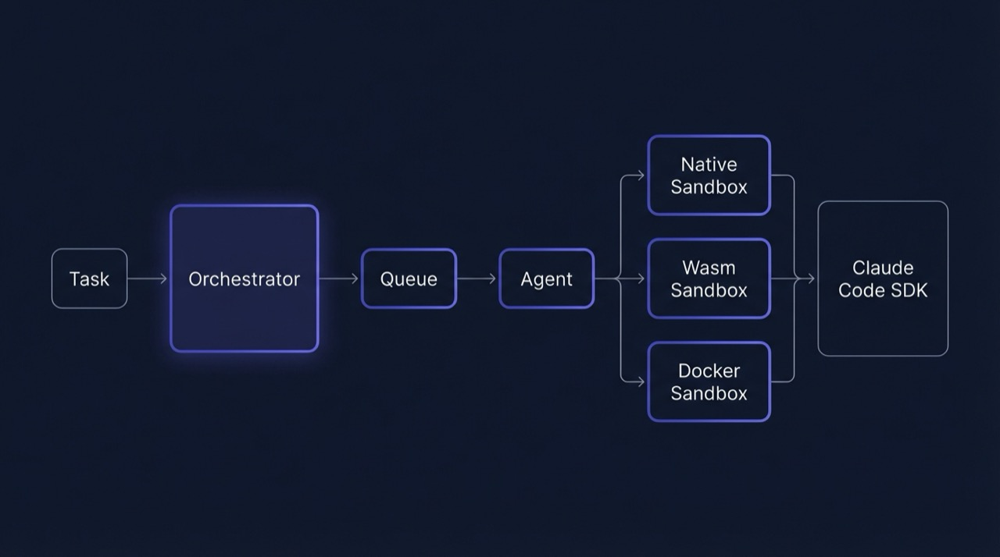

<p align="center">
  
</p>

<p align="center">
  <a href="https://www.typescriptlang.org/"></a>
  <a href="https://bun.sh/"></a>
  <a href="LICENSE"></a>
</p>

BAARA Next runs Claude-powered agent tasks that survive process crashes, resume
from checkpoints, and retry automatically on failure. Control tasks through a
chat-centric web UI, the Claude Code MCP integration, or a full REST API — all
from a single `bun start`.

"baara" means "work" in Mandinka.

---

## Quick Start

```sh
git clone https://github.com/fakoli/baara-next.git
cd baara-next
bun install
ANTHROPIC_API_KEY=sk-ant-... bun start
```

Open **http://localhost:3000** in your browser.

---

## What is BAARA Next?

BAARA Next is a durable agent task execution engine: you define tasks with
prompts, it runs the Claude Code SDK agent inside configurable sandbox isolation
(Native, Wasm, or Docker), checkpoints the conversation every 5 turns, and
resumes automatically after crashes. Tasks flow through an 11-state lifecycle
with exponential-backoff retries and a dead-letter queue for permanent failures.

The web UI gives you a chat interface backed by 27 MCP tools — create tasks, run
them, inspect logs, answer human-in-the-loop questions, and monitor queue depths,
all without leaving the conversation. Claude Code connects to the same 27 tools
via `.mcp.json` and stdio transport.

BAARA Next is 100% TypeScript on Bun. No Go, no Rust, no native addons. Run the
full system with one command.

---

## Features

- **Durable execution** — Conversation-level checkpointing means the agent
  resumes exactly where it left off after a crash or restart.
- **11-state lifecycle** — `created → queued → assigned → running →
  waiting_for_input → completed / failed / timed_out / cancelled /
  retry_scheduled → dead_lettered`
- **Exponential-backoff retries** — Configure `maxRetries` per task; exhausted
  tasks land in the dead-letter queue (DLQ).
- **Pluggable sandboxes** — Native (host process), Wasm (Extism isolation), or
  Docker container — swap per task without changing business logic.
- **27-tool MCP server** — Claude Code connects directly via `.mcp.json` (stdio
  transport) or HTTP (`/mcp` endpoint).
- **Chat-centric UI** — React/Vite/Tailwind frontend with real-time SSE
  streaming, inline execution cards, and persistent conversation threads.
- **JSONL logging** — Every execution writes structured logs; query by level,
  search, and offset.
- **Human-in-the-loop** — Agent can pause mid-execution, ask a question, and
  resume when you respond.
- **Single-binary dev mode** — Orchestrator, agent, and HTTP server run in one
  process. No Docker required to get started.
- **Full CLI parity** — All operations available as `baara` sub-commands in
  addition to the HTTP API.
- **Claude Code integration** — Connect the full 27-tool surface directly inside
  Claude Code via `.mcp.json`.

---

## Architecture

<p align="center">
  
</p>

See [docs/architecture.md](docs/architecture.md) for the full component diagram,
state machine, and data flow.

---

## Claude Code Integration

Add BAARA Next as an MCP server in your project's `.mcp.json`:

```json
{
  "mcpServers": {
    "baara-next": {
      "command": "bun",
      "args": ["run", "/path/to/baara-next/packages/cli/src/index.ts", "mcp-server"],
      "env": {
        "ANTHROPIC_API_KEY": "${ANTHROPIC_API_KEY}"
      }
    }
  }
}
```

Then in Claude Code: "Create a task that clones my repo and runs the tests."

See [docs/mcp-integration.md](docs/mcp-integration.md) for the full 27-tool
reference.

---

## CLI Quick Reference

| Command | Description |
|---------|-------------|
| `bun start` | Start server (orchestrator + agent + HTTP API) |
| `bun start --port 8080` | Start on a custom port |
| `bun start --data-dir ./data` | Custom data directory |
| `baara tasks list` | List all tasks |
| `baara tasks create --name <n> --prompt <p>` | Create a task |
| `baara tasks run <name>` | Run a task directly |
| `baara executions list` | List recent executions |
| `baara executions logs <id>` | Tail execution logs |
| `baara queues list` | Show queue depths |
| `baara admin dlq` | Inspect the dead-letter queue |
| `baara chat` | Start interactive chat REPL |
| `baara mcp-server` | Run MCP server on stdio (for Claude Code) |

---

## Configuration

| Variable | Default | Description |
|----------|---------|-------------|
| `ANTHROPIC_API_KEY` | — | Required for agent execution and chat |
| `BAARA_API_KEY` | — | Enable API key auth on all `/api/*` routes |
| `BAARA_SHELL_ENABLED` | `false` | Allow shell task execution |
| `PORT` | `3000` | HTTP server port |
| `HOST` | `0.0.0.0` | Hostname to bind |
| `NEXUS_DIR` | `~/.baara` | Data directory for SQLite and logs |

See [docs/configuration.md](docs/configuration.md) for the full reference.

---

## Documentation

| File | Topic |
|------|-------|
| [docs/architecture.md](docs/architecture.md) | 10-package overview, data flow, state machine |
| [docs/sandbox-guide.md](docs/sandbox-guide.md) | ISandbox interface, three implementations, adding a sandbox |
| [docs/mcp-integration.md](docs/mcp-integration.md) | 27-tool MCP catalog, Claude Code setup |
| [docs/api-reference.md](docs/api-reference.md) | Every REST endpoint with request/response |
| [docs/chat-architecture.md](docs/chat-architecture.md) | SSE protocol, event types, thread model |
| [docs/durability.md](docs/durability.md) | Checkpoint model, recovery flow, Temporal comparison |
| [docs/configuration.md](docs/configuration.md) | Environment variables, CLI flags |
| [docs/contributing.md](docs/contributing.md) | Dev setup, running tests, PR guidelines |

---

## Contributing

See [docs/contributing.md](docs/contributing.md).

---

## License

MIT — see [LICENSE](LICENSE).
