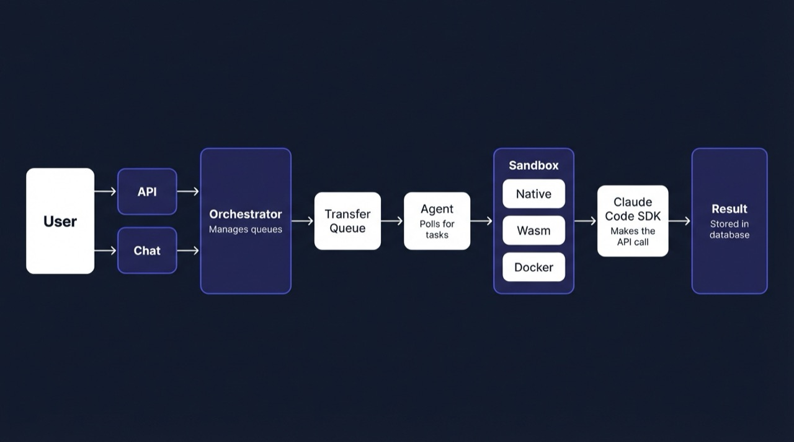
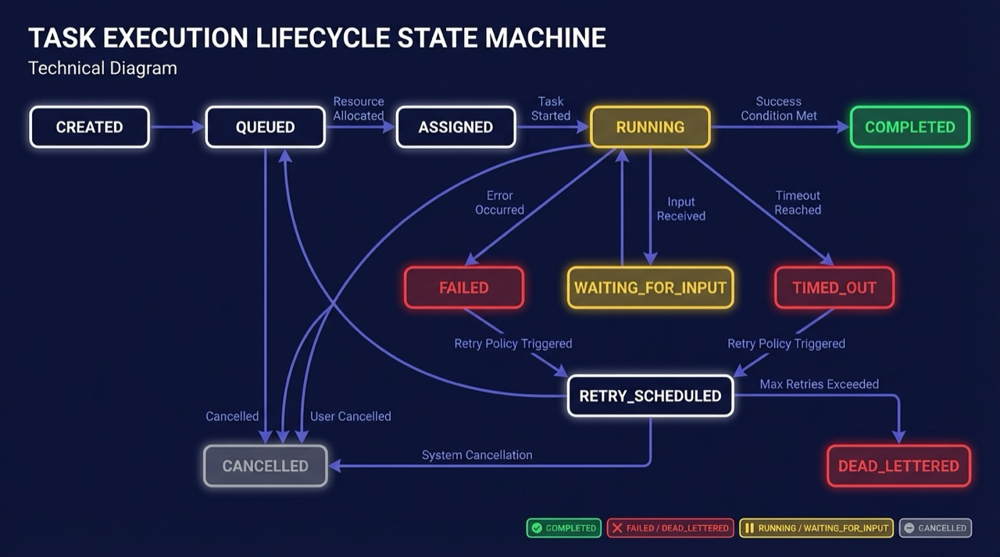
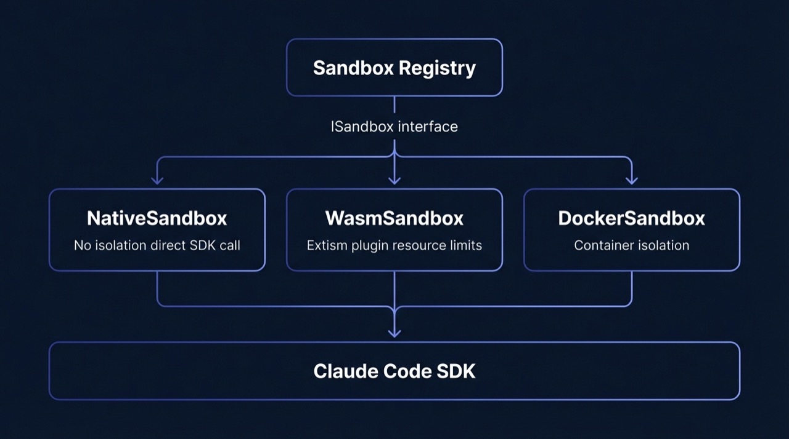

# Architecture

BAARA Next is a monorepo of 10 TypeScript packages on Bun. In dev mode, all
packages run in a single process started with `bun start`. The design is
deliberately process-agnostic — the same packages wire together via HTTP
transport in production mode.

---

## Packages

| Package | Path | Responsibility |
|---------|------|----------------|
| `core` | `packages/core` | Shared types, interfaces (IStore, ISandbox, IMessageBus), state machine, errors |
| `store` | `packages/store` | SQLite persistence via `bun:sqlite`. Implements IStore. |
| `orchestrator` | `packages/orchestrator` | OrchestratorService: queue management, retry scheduler, health monitor, DLQ |
| `agent` | `packages/agent` | AgentService: polls for assigned executions, drives the runtime loop |
| `executor` | `packages/executor` | SandboxRegistry, NativeSandbox, WasmSandbox, DockerSandbox, CheckpointService, MessageBus, JSONL log reader |
| `transport` | `packages/transport` | DevTransport (in-process) and HttpTransport (production) — bridges agent to orchestrator |
| `server` | `packages/server` | Hono HTTP server: mounts all route groups, CORS, rate limiting, API key auth |
| `mcp` | `packages/mcp` | 27-tool MCP server. Runs as in-process server (chat), stdio transport (Claude Code), or HTTP endpoint (`/mcp`) |
| `cli` | `packages/cli` | Commander.js CLI: `start`, `tasks`, `executions`, `queues`, `admin`, `chat`, `mcp-server` |
| `web` | `packages/web` | React/Vite/Tailwind frontend: chat UI, task management, execution monitoring |

---

## Component Diagram

  

---

## Data Flow

A queued task moves through the system in six steps:

  

1. **API or MCP call** — `POST /api/tasks/:id/submit` → `OrchestratorService.submitTask()` → creates execution in `queued` status
2. **Queue dequeue** — QueueManager dequeues → status transitions to `assigned` → DevTransport delivers to AgentService
3. **Agent picks up** — AgentService polls transport → `orchestrator.startExecution()` → status transitions to `running`
4. **Sandbox executes** — `NativeSandboxInstance.execute()` → Claude Code SDK `query()` with MCP tools → SandboxEvent stream → CheckpointService writes every 5 turns
5. **Completion** — `orchestrator.handleExecutionComplete()` → status transitions to `completed | failed | timed_out` → ExecutionEvent appended
6. **Failure → retry** — `failed | timed_out` → `retry_scheduled` (if `attempt < maxRetries`) → re-enqueues after backoff → exhausted → `dead_lettered`

---

## State Machine

All 11 execution states with valid transitions:

  

Terminal states — `completed`, `cancelled`, `dead_lettered` — have no outgoing
transitions. The state machine is enforced by `validateTransition()` in
`packages/core/src/state-machine.ts`; every call to `store.updateExecutionStatus()`
must pass this check.

---

## Event Sourcing (Hybrid Model)

BAARA Next uses a hybrid persistence model — not pure event sourcing:

- **Events** (`execution_events` table): append-only audit log. Every status
  change, tool call, checkpoint, and log line appends a row with a monotonically
  increasing `eventSeq`. Used for the web UI Events tab and the
  `get_execution_events` MCP tool.
- **State** (`executions` table): mutable current state. Authoritative for
  status, health, turn count, output, and checkpoint data.

Recovery does not replay events. The executor loads the last checkpoint from
`task_messages`, injects it as conversation history, and continues from turn N+1.
This is O(1) regardless of how many events exist — see
[docs/durability.md](durability.md).

---

## Sandbox Architecture

All three sandbox implementations share a single interface (`ISandbox`) and a
single execution engine (Claude Code SDK). What changes between sandboxes is the
isolation layer around the SDK call.

  

See [docs/sandbox-guide.md](sandbox-guide.md) for the full ISandbox interface
and instructions for adding a new sandbox type.
