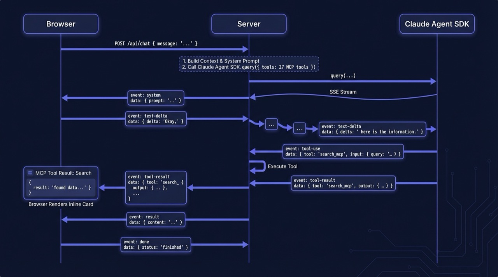

# Chat Architecture

The chat interface connects a browser conversation to the Claude Code SDK agent
running with all 27 BAARA Next MCP tools. The server streams events back over
Server-Sent Events (SSE); the client renders them in real time as text and inline
execution cards.

---

## SSE Streaming Protocol

<p align="center">
  
</p>

`POST /api/chat` accepts a JSON body and returns `Content-Type: text/event-stream`.

Each SSE event has:
- `event: message` (or `event: done` for the terminal event)
- `id: <monotonically increasing integer>`
- `data: <JSON string>`

The client parses the `data` field as JSON and dispatches on `data.type`.

**Request:**

```json
{
  "message": "Create a task that runs the CI tests.",
  "sessionId": "uuid-or-omit",
  "threadId": "uuid-or-omit",
  "activeProjectId": "uuid-or-null"
}
```

**Response stream:**

```
id: 0
event: message
data: {"type":"system","sessionId":"abc123","threadId":"def456","toolCount":27}

id: 1
event: message
data: {"type":"text_delta","delta":"I'll create a task for you."}

id: 2
event: message
data: {"type":"text","content":"I'll create a task for you."}

id: 3
event: message
data: {"type":"tool_use","name":"create_task","input":{"name":"ci-tests","prompt":"Run the test suite."}}

id: 4
event: message
data: {"type":"tool_result","name":"create_task","output":{"ok":true,"data":{...}},"isError":false}

id: 5
event: message
data: {"type":"result","text":"Done! I created a task called ci-tests.","isError":false,"usage":{"inputTokens":340,"outputTokens":42},"costUsd":0.0021,"durationMs":4200}

id: 6
event: done
data: {"type":"done"}
```

---

## Event Types

### `system`

Sent once as the first event. Contains the session and thread IDs the client
must persist for conversation continuity.

```json
{
  "type": "system",
  "sessionId": "uuid",
  "threadId": "uuid",
  "toolCount": 27
}
```

- `sessionId` — the Claude Code SDK session ID. Pass this back in subsequent
  requests as `sessionId` to resume the same Agent SDK session (preserves tool
  call history and conversation context).
- `threadId` — the BAARA Next thread ID. Pass this back as `threadId` to link
  future turns to the same thread for history display.

### `text_delta`

A partial text token emitted in real time as the agent generates its response.
Render these incrementally for a streaming typewriter effect.

```json
{
  "type": "text_delta",
  "delta": "I'll create"
}
```

### `text`

The complete assistant text block for a finished turn. This is the final,
assembled version of all the preceding `text_delta` events for that block.

```json
{
  "type": "text",
  "content": "I'll create a task called ci-tests that runs your test suite."
}
```

### `tool_use`

The agent invoked an MCP tool. Use this to render a "thinking" or "working"
card while the tool executes.

```json
{
  "type": "tool_use",
  "name": "create_task",
  "input": {
    "name": "ci-tests",
    "prompt": "bun test",
    "sandboxType": "native"
  }
}
```

### `tool_result`

The MCP tool returned. `isError: true` means the tool's handler returned an
error response (not a transport-level failure).

```json
{
  "type": "tool_result",
  "name": "create_task",
  "output": { "ok": true, "data": { "id": "uuid", "name": "ci-tests" } },
  "isError": false
}
```

### `result`

The final summary for the entire agent turn. Contains token usage and cost.
Rendered as a footer on the assistant message.

```json
{
  "type": "result",
  "text": "Done! Created task ci-tests.",
  "isError": false,
  "usage": { "inputTokens": 340, "outputTokens": 42 },
  "costUsd": 0.0021,
  "durationMs": 4200
}
```

`isError: true` means the entire agent run failed (e.g., max turns exceeded,
budget exceeded).

### `done`

Terminal event. The SSE stream closes after this event. The client should stop
waiting for more events.

```json
{ "type": "done" }
```

### `error`

Emitted if the server encounters a stream error (e.g., Anthropic API
unavailable). Always followed by `done`.

```json
{
  "type": "error",
  "message": "Stream failed: connection reset"
}
```

---

## Inline Card Rendering

The web UI renders certain `tool_result` events as inline execution cards
rather than raw JSON. The rendering rule is based on the tool name:

| Tool name | Card type | Contents |
|-----------|-----------|----------|
| `create_task` | Task card | Task name, sandbox type, execution mode |
| `run_task` | Execution card | Execution ID, status, duration |
| `submit_task` | Execution card | Execution ID, queued status |
| `get_execution` | Execution detail card | Full status, turn count, health |
| `get_system_status` | System status card | Queue depths, running count, DLQ count |
| `list_executions` | Execution table | Compact row per execution |
| `dlq_list` | DLQ card | Count, oldest error |
| `list_pending_input` | HITL card | Prompt + action button |

All other tool results render as a collapsible JSON block.

---

## Thread Model

A **thread** is the persistent container for a conversation and all executions
launched from it.

```
Thread (title, id, createdAt, updatedAt)
  ├── ConversationTurn 1 (stored in Agent SDK session file)
  ├── ConversationTurn 2
  │     └── Execution uuid (linked via threadId on Execution row)
  ├── ConversationTurn 3
  └── ...
```

### Thread creation

If `threadId` is absent from the request body, the chat route creates a new
thread using the first 60 characters of the user message as the title:

```typescript
const title = message.trim().slice(0, 60);
const newThread = store.createThread(crypto.randomUUID(), title);
```

The new `threadId` is sent back in the first `system` event so the client can
persist it for subsequent turns.

### Session continuity

The `sessionId` is the Claude Code SDK session ID. When the client provides
`sessionId` in the request body, the SDK resumes from the existing session
file (`~/.baara/sessions/<sessionId>.json`), which contains the full message
history. This is how multi-turn conversations maintain context across HTTP
requests.

New sessions are created by passing `options.sessionId = resolvedSessionId`
on the first turn. Subsequent turns pass `options.resume = sessionId` to
restore the session.

### Execution linkage

When the agent calls `run_task` or `submit_task` via MCP, the resulting
execution is linked to the current thread by calling:

```typescript
store.linkExecutionToThread(execution.id, threadId);
```

The web UI uses `store.listExecutionsByThread(threadId)` to display the
execution history for a conversation.

---

## Session Management

Session files are stored at `{dataDir}/sessions/` by the Agent SDK. The BAARA
Next server forwards `dataDir` to the chat route so session files land in the
same data directory as the SQLite database (default: `~/.baara/`).

Sessions are not garbage-collected automatically. To clear all sessions:

```sh
rm -rf ~/.baara/sessions/
```

Threads remain in the database after sessions are deleted; the next turn on an
orphaned thread creates a new SDK session and continues as a new conversation.
